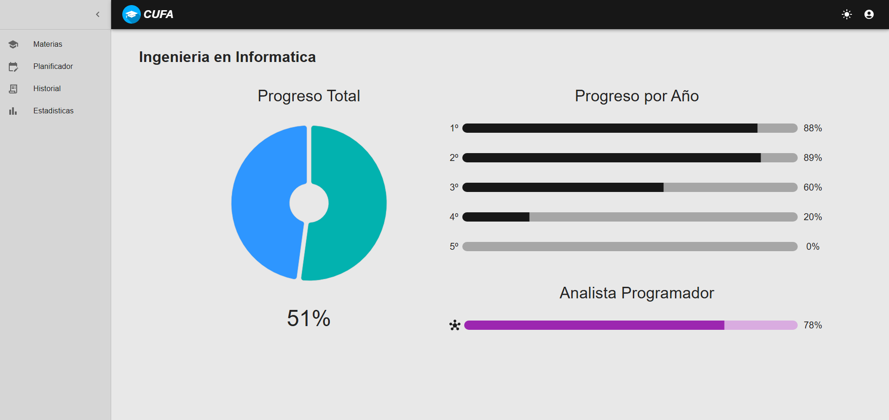
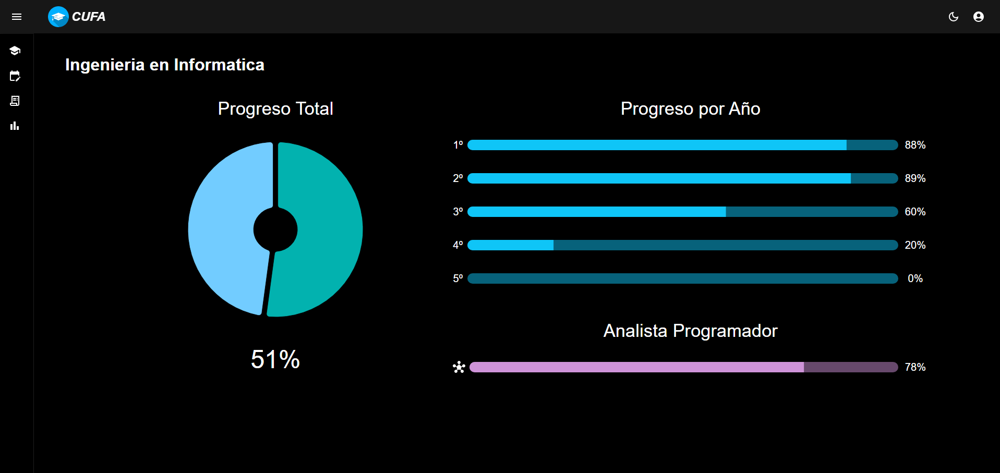
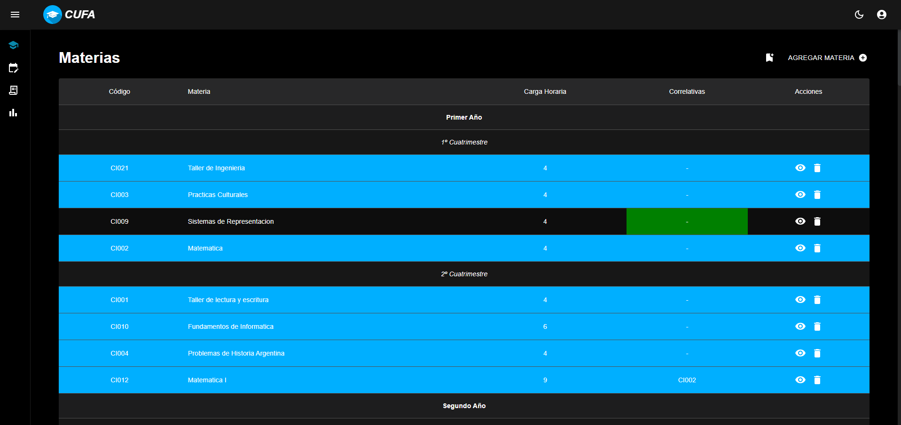
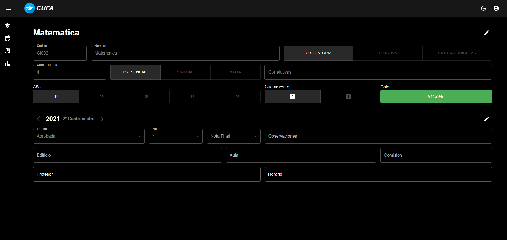
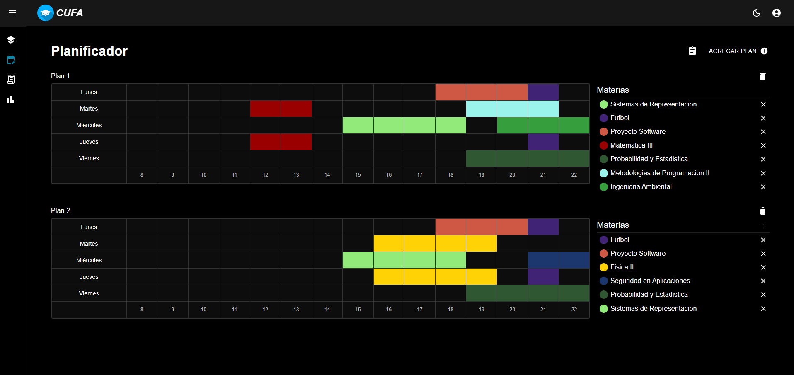
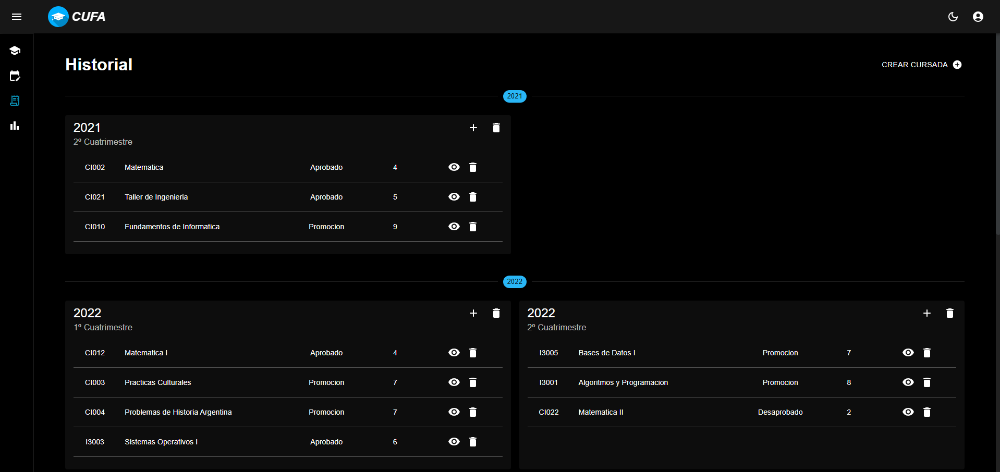
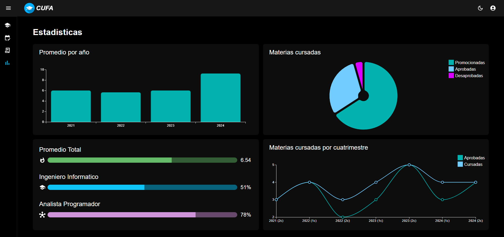

# Gestor de Materias de la Facultad

Una aplicación para organizar y visualizar el progreso académico en la facultad.  
Permite gestionar materias, profesores, horarios, comisiones, etc., además de hacer un seguimiento del avance en la carrera.

## 📌 Funcionalidades
✅ Agregar, editar y eliminar materias.  
✅ Registrar si una materia fue cursada y su resultado (aprobada/promocionada/desaprobada/en curso, nota).  
✅ Ver el progreso en la carrera: materias cursadas por cuatrimestre, avance total, promedios, etc.  
✅ Crear y administrar usuarios.  

---

## 🏠 Home  
_Modo claro y oscuro de la pantalla principal_  
  
  

---

## 📚 Gestión de Materias  
_Vista de todas las materias y detalles de una materia específica_  
  
  

---

## 📅 Planificador  
_Organiza tus materias y horarios de cursada_  
  

---

## 📜 Historial Académico  
_Registro de todas las materias cursadas y sus resultados_  
  

---

## 📊 Estadísticas  
_Visualización del progreso en la carrera_  
  

---

## 🛠️ Tecnologías Utilizadas  

### 🎨 Frontend  
- React  
- JavaScript  
- Material UI  

### ⚙️ Backend  
- Node.js  
- Express  
- MongoDB  
- Mongoose  
- Zod  
